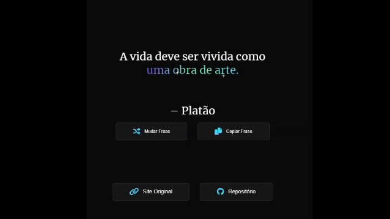

# Sparkle Words

"Sparkle Words" é um projeto simples e elegante que destaca animações e estilos visuais atrativos.

## Descrição

Este projeto exibe uma citação de alguns pensadores usando HTML, CSS/Sass e JavaScript. A citação é apresentada com animações de estrelas brilhantes ao redor do texto, criando um efeito visual encantador. É ideal para páginas de apresentação, sites pessoais ou qualquer projeto que precise de um toque filosófico e inspirador.

## Captura de Tela



## Tecnologias Utilizadas

- HTML
- CSS (com SCSS para organização de estilos e performance)
- JavaScript
- [SVGInject](https://github.com/iconfu/svg-inject) para manipulação de SVGs
- [Font Awesome](https://fontawesome.com) para ícones
- [Google Fonts - Merriweather](https://fonts.google.com/specimen/Merriweather) para tipografia

## Estrutura do Projeto


## Contribuição

Sinta-se à vontade para contribuir com este projeto. Para isso:

1. Faça um fork do projeto

2. Crie uma branch para sua feature:
    ``` bash
    git checkout -b 'minha-nova-feature'
3. Commit suas alterações:
    ``` bash
    git commit -m 'Adiciona nova feature'
4. Push para a branch:
    ``` bash
    git push origin 'minha-nova-feature'

5. Abra um Pull Request

## Referências

- [SVGInject](https://github.com/iconfu/svg-inject)
- [Font Awesome](https://fontawesome.com)
- [Google Fonts - Merriweather](https://fonts.google.com/specimen/Merriweather)
- [Linear](https://linear.app/readme)